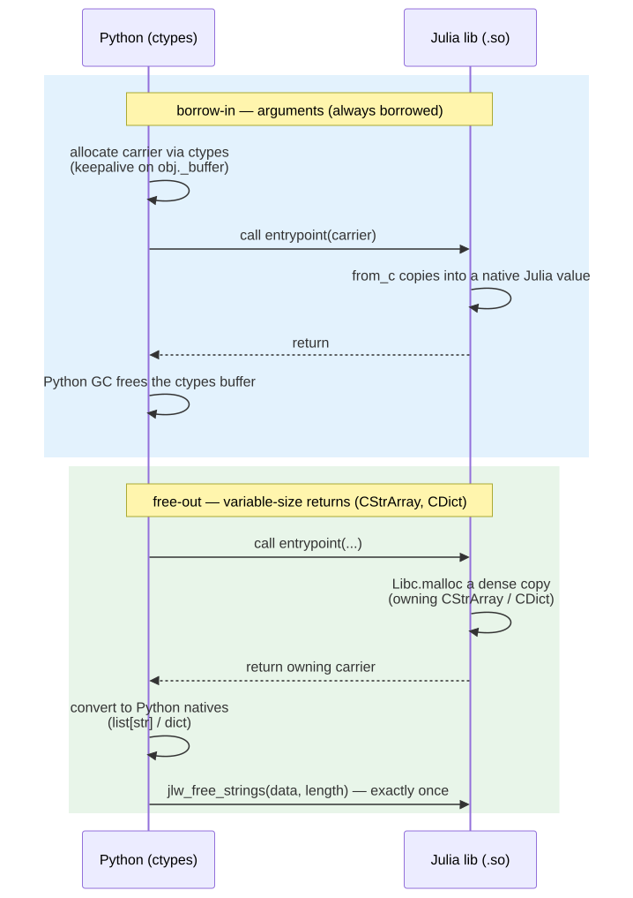

```@meta
CurrentModule = JLWInterop
```

# L1 carriers: `CStrArray`, `CDict`, `COpt`

This page documents the **Layer-1 shared carriers** added to `JLWInterop` for
variable-size and optional data: an array of strings, a string-keyed
dictionary, and an optional scalar. They sit alongside the non-owning
`CArray`/`CString`/`JLWStatus` vocabulary described in [JLWInterop](@ref) and
follow the same recognition convention — the
[JuliaLibWrapping](@ref) Python emitter matches a struct **by name plus field
shape**, not by package identity, so a copy-pasted compatible definition
still gets the generated helpers.

## Where they sit in the layer plan

JuliaLibWrapping's design is layered: `juliac` compiles and emits a pure
C-ABI description with no semantic metadata; `JLWInterop` is the shared
vocabulary of carrier types that give that metadata meaning; a future
annotation layer will let users opt into richer bindings; and each target
language's emitter (Python today, MATLAB via
[Mexicah](https://github.com/JuliaInterop/Mexicah.jl)) consumes the same L1
types.


> Diagram source: [`docs/src/assets/l1-layers.mmd`](assets/l1-layers.mmd);
> regenerate with `mmdc -i l1-layers.mmd -o l1-layers.svg -b transparent`.

## Struct layouts

All three carriers are plain `isbits`-when-possible structs with a fixed C
layout. Field order matches declaration order; the compiler inserts padding
only where alignment requires it (see `COpt` below).



> Diagram source: [`docs/src/assets/carrier-layouts.mmd`](assets/carrier-layouts.mmd);
> regenerate with `mmdc -i carrier-layouts.mmd -o carrier-layouts.svg -b transparent`.

## Ownership contract

Two patterns cover every direction data can cross the ABI boundary, following
the same "borrow-in stays universal; ownership enters only on variable-size
returns" split used by libraries like libgit2 and `sqlite3_free`:

- **Arguments are always borrowed.** The generated Python helper allocates
  the carrier via `ctypes` and keeps a reference alive on the returned
  object (`obj._buffer`, the same keepalive pattern `CArray.from_numpy` and
  `CString.from_str` already use). The Julia-side conversion (`Base.Dict`,
  `Base.Vector{String}`, …) copies the data into a fresh native Julia value
  and never frees the caller's buffers. Python's own garbage collector frees
  the `ctypes` buffer once nothing references it.
- **Variable-size returns own their storage.** When a Julia function returns
  a `CStrArray` or `CDict`, Julia `Libc.malloc`s a dense copy of the data. The
  generated Python wrapper converts that malloc'd buffer into idiomatic
  Python objects (`list[str]` / `dict`) and then releases the Julia-owned
  memory immediately, through the wrapped library's own exported release
  entrypoints — see [`@export_release_entrypoints`](@ref) below.
- **`COpt` is by-value.** It carries no pointer and needs no ownership
  handling in either direction — see [`COpt{T}`](@ref).



> Diagram source: [`docs/src/assets/ownership-seq.mmd`](assets/ownership-seq.mmd);
> regenerate with `mmdc -i ownership-seq.mmd -o ownership-seq.svg -b transparent`.

Rejected alternative, for the record: a caller-allocated two-call protocol
(ask for the size, allocate, call again to fill) was considered and rejected
— an arbitrary user callee cannot safely run twice without duplicating side
effects, and caching the first call's result would need registry state that
the rest of this design deliberately avoids.

## `CStrArray` — an array of strings

```julia
struct CStrArray
    length::Int64
    data::Ptr{Ptr{UInt8}}     # each element NUL-terminated UTF-8
end
```

| Julia | Python |
|---|---|
| `Vector{String}` | `list[str]` |

- **Borrow-in** (`Base.Vector{String}(a::CStrArray)`): copies the strings out
  into a fresh `Vector{String}`; never frees `a.data` or the per-string
  buffers. The Python side builds the carrier with `CStrArray.from_list`,
  which keeps `(bufs, arr)` alive on `obj._buffer`.
- **Own-out** (`CStrArray(v::Vector{String})`): `Libc.malloc`s the pointer
  array and each per-string buffer. The generated Python wrapper reads the
  result with `.as_list()`, then releases the buffers with
  `_lowlevel._lib.jlw_free_strings(result.data, result.length)`.

```@docs
CStrArray
```

## `CDict{V}` — a string-keyed dictionary

```julia
struct CDict{V}
    length::Int64
    keys::Ptr{Ptr{UInt8}}
    values::Ptr{V}
end
```

| Julia | Python |
|---|---|
| `Dict{String,V}` for `V` in [`CDICT_VALUE_TYPES`](@ref) | `dict[str, V]` |

`V` is a closed, trim-safe allowlist of 11 scalar types
([`CDICT_VALUE_TYPES`](@ref)) — the per-`V` conversion methods are generated
only for those types, so an unsupported `V` fails as a `MethodError` at the
call site rather than compiling something unsound.

- **Borrow-in** (`Base.Dict{String,V}(d::CDict{V})`): copies keys and values
  out into a fresh `Dict`; never frees `d.keys`, the per-key buffers, or
  `d.values`. The Python side builds the carrier with `CDict.from_dict`.
- **Own-out** (`CDict(d::Dict{String,V})`): `Libc.malloc`s the key pointer
  array, each per-key buffer, **and** the value array — two separate
  allocations. The generated Python wrapper reads the result with
  `.as_dict()`, then releases **both**: the keys via
  `_lowlevel._lib.jlw_free_strings(result.keys, result.length)` and the
  values via `_lowlevel._lib.jlw_free(ctypes.cast(result.values, ctypes.c_void_p))`.

```@docs
CDict
CDICT_VALUE_TYPES
```

## `COpt{T}` — an optional scalar

```julia
struct COpt{T}
    has_value::Int32
    value::T
end
```

| Julia | Python |
|---|---|
| `Union{T,Nothing}` for scalar `T` | `T \| None` |

`has_value` is `Int32` (not `Bool`) so the struct stays a portable, four-byte
discriminant across languages; `1` means present, `0` means absent. `value`
is always inline — zero-filled in the absent branch, per the `COpt{T}(nothing)`
constructor — so the struct stays `isbits`, needs no heap allocation, and
needs no ownership handling in either direction: `from_optional`/`as_optional`
on the Python side are plain field reads, with no `_buffer` keepalive and no
release call.

```@docs
COpt
unwrap
```

## `@export_release_entrypoints` — required for owning returns

A library that returns `CStrArray` or `CDict` from any entrypoint must call
`JLWInterop.@export_release_entrypoints` once, at top level of its entry
module:

```julia
using JLWInterop

JLWInterop.@export_release_entrypoints
```

This emits two `@ccallable` functions — `jlw_free` and `jlw_free_strings` —
that the generated Python façade calls to release Julia-malloc'd buffers (see
[Ownership contract](@ref) above). The macro-emitted `@ccallable`s reach the
ABI JSON exactly like a hand-written one (confirmed in
[`design/spike-notes.md`](https://github.com/JuliaInterop/JuliaLibWrapping.jl/blob/main/design/spike-notes.md)),
so no extra emitter-side plumbing is needed to make them visible.

Without it, the ABI JSON carries no ownership metadata at all (see
`design/spike-notes.md` again — this is a fundamental limitation of a pure
C-ABI description, not a bug), so
[`_release_symbols_present`](@ref JuliaLibWrapping._release_symbols_present)
cannot find `jlw_free`/`jlw_free_strings` among the library's exported
symbols. Rather than emit a façade call to a symbol that does not exist, the
emitter refuses to auto-wrap the owning return and falls back to a
mechanical re-export with a `TODO` comment. The exact text a user sees in the
generated `_facade.py` is:

```
from ._lowlevel import my_func  # TODO: hand-wrap — owning return needs release entrypoints; add JLWInterop.@export_release_entrypoints to the library
```

Add the macro call and regenerate (`write_wrapper`/`build_library` again) to
turn that into a full `list[str]`/`dict`-returning wrapper.

```@docs
@export_release_entrypoints
_free_strings
```

### Free exactly once, always via the same package's `_lib`

Every malloc backing an owning `CStrArray`/`CDict` return must be freed
**exactly once**, and **only** through the `jlw_free`/`jlw_free_strings`
symbols resolved from that same package's own `_lib` (the `ctypes.CDLL`
handle `_lowlevel.py` opens for the wrapped shared library) — never through
Python's `ctypes` allocator, never through a different wrapped library's
`_lib`, and never twice. Two reasons this matters:

- **Symbol resolution is per-handle.** `jlw_free`/`jlw_free_strings` are
  ordinary C symbols exported by the wrapped `.so`; two different wrapped
  libraries each export their own copies. Calling library A's `_lib.jlw_free`
  on a pointer that library B's `Libc.malloc` produced is undefined behavior
  even though both symbols have the same name and signature — they may be
  backed by different `libc`s (statically linked, or dynamically linked
  against different C library builds) with incompatible heaps.
  Per-`CDLL`-handle lookup is exactly what keeps two wrapped libraries from
  colliding: malloc and free stay within the one library that performed the
  allocation.
- **Freeing twice, or freeing a borrowed pointer, corrupts the heap.** The
  generated façade code calls the release entrypoint exactly once, right
  after converting the owning carrier to native Python objects (see the
  sequence diagram above). Hand-written code that bypasses the façade and
  talks to `_lowlevel` directly must preserve that same "convert once, free
  once" ordering.

## Scope note: carriers are ctypes-target-side

`CStrArray`, `CDict`, and `COpt` describe C-ABI layouts consumed by the
Python `ctypes` emitter (and any other target that talks raw C structs).
MATLAB's [Mexicah](https://github.com/JuliaInterop/Mexicah.jl) target does
**not** use these struct layouts — its carrier remains `mxArray`, MATLAB's
own native array type, produced and consumed through the MEX C API rather
than `ctypes.Structure`. What the two targets share is not the struct
layout but the **protocol**: the Julia↔target type-mapping table (this
page's tables), and the ownership discipline (borrow-in for arguments,
own-out-then-free-exactly-once for variable-size returns, by-value for
optionals). A future MATLAB carrier would reuse that discipline while
mapping onto `mxArray`'s own allocation and lifetime rules, not onto
`CStrArray`/`CDict`/`COpt`.
