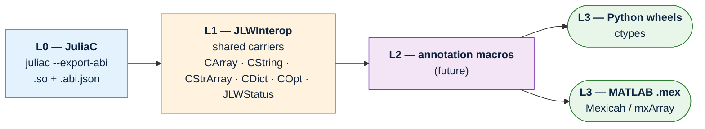
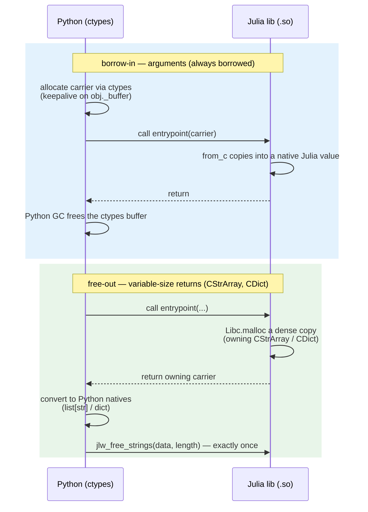
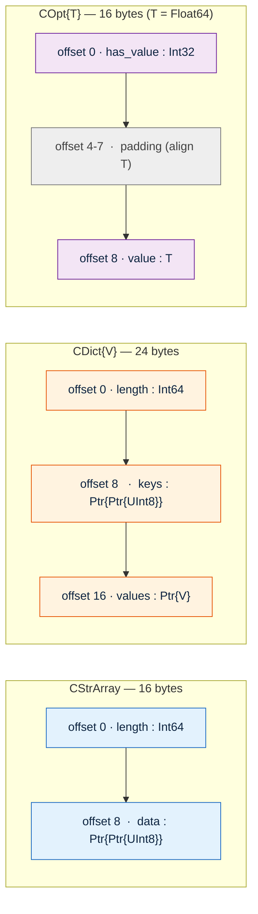

# Layer-1 shared carriers

**Status:** implemented on `l1-carriers`, upstreamed as draft PR #62 against
issue #38. This document is the design record: context, the decisions that
are locked, the ownership model and its rationale, what was deliberately
deferred, and what is still open for review.

## Context: the layer plan (#38)

JuliaLibWrapping's ABI generation is being split into layers so each one has
a single, testable job:

- **L0 (JuliaC.jl)** compiles a trimmed shared library and emits a pure
  C-ABI JSON description: struct field offsets/sizes/alignment, pointer
  indirection chains, function symbols and signatures. It carries zero
  semantic metadata — see [spike findings](#spike-findings) below.
- **L1 (this work, `JLWInterop`)** is the shared vocabulary of carrier
  types — `CArray`, `CString`, `JLWStatus` (already shipping) plus the three
  new ones this PR adds: `CStrArray`, `CDict{V}`, `COpt{T}`. A struct that
  matches one of these shapes gets richer, idiomatic bindings instead of a
  raw pointer the emitter can't reason about.
- **L2 (future)** is an annotation-macro layer for users who want to opt
  into behavior beyond structural recognition (e.g. explicit ownership
  hints, custom error-code registries). Not designed yet; out of scope here.
- **L3** is the per-target-language emitter: `PythonTarget` (`ctypes`,
  shipping) and a future Mexicah/MATLAB target (`mxArray`, not this PR — see
  [Scope note: MATLAB](#scope-note-re-matlab-mexicah) below).

This PR is the **L1 slice**: three carriers ported from ParselTongue's
proven boundary-type design into `JLWInterop`, plus (in progress on the same
branch) the Python-emitter recognizers, façade helpers, and an end-to-end
example.

## Locked decisions

1. **Three new carrier types**, each recognized structurally (name +
   field shape, matching the existing `CArray`/`CString`/`JLWStatus`
   convention — not by package identity, so a copy-pasted compatible
   definition still gets the generated helpers):
   - `CStrArray` — `(length::Int64, data::Ptr{Ptr{UInt8}})`, an array of
     NUL-terminated UTF-8 strings ↔ Python `list[str]`.
   - `CDict{V}` — `(length::Int64, keys::Ptr{Ptr{UInt8}}, values::Ptr{V})`,
     a string-keyed dictionary ↔ Python `dict[str, V]`. `V` is a closed,
     trim-safe allowlist of 11 scalar types (`CDICT_VALUE_TYPES`); the
     per-`V` conversion methods are the only ones generated, so an
     unsupported `V` fails as a `MethodError` at the call site rather than
     compiling something unsound.
   - `COpt{T}` — `(has_value::Int32, value::T)`, an optional scalar ↔
     Python `T | None`. `has_value` is `Int32` rather than `Bool` so the
     struct stays a portable four-byte discriminant; `value` is always
     inline (zero-filled when absent) so the whole struct stays `isbits`
     and needs no allocation or ownership handling in either direction.
2. **`@export_release_entrypoints`** — a macro, not a snippet the user
   pastes by hand. It emits two `Base.@ccallable` functions
   (`jlw_free`, `jlw_free_strings`) at top level of the entry module. The
   spike (below) confirmed macro-emitted `@ccallable`s reach the ABI JSON
   exactly like hand-written ones, so this was safe to build as ergonomic
   macro sugar rather than requiring users to write the `@ccallable`s
   themselves.
3. **`JLWInterop` stays dependency-free** and keeps `julia = "1.10"` compat.
   The three new types and the macro add no new package dependencies.
4. **Field layout is read from the ABI JSON, never hand-computed** by any
   consumer. `COpt{Float64}`'s 4 bytes of trailing padding between
   `has_value` (`Int32`, ends at offset 4) and `value` (`Float64`, needs
   8-byte alignment, starts at offset 8) is the concrete case that makes
   this non-negotiable — see [spike findings](#spike-findings).

## The ownership model

**Borrow-in stays universal; ownership enters only on variable-size
returns.** This is the libgit2 / `sqlite3_free` pattern: most C APIs never
transfer ownership at all — the caller allocates, the callee borrows for the
duration of the call, and the caller frees. Ownership transfer is reserved
for the narrow case where the callee itself must allocate because the
result's size isn't known to the caller in advance (a formatted string, a
result set). Those APIs return an owning pointer through a *documented*
channel and pair it with an explicit, matching release function
(`sqlite3_free`, `git_buf_dispose`) — never an ambient convention the caller
has to infer.

Applied here:

- **Arguments are always borrowed.** The generated Python helper allocates
  via `ctypes` (keepalive on `obj._buffer`, the same pattern
  `CArray.from_numpy` already uses); the Julia-side conversion copies and
  never frees. This deliberately retires ParselTongue's
  transfer-on-success/disarm machinery from the boundary-type design this
  was ported from — in a shim-less `ctypes` world (no generated C glue layer
  sitting between Python and the Julia entrypoint), Python owns all argument
  memory, full stop, so there is no transfer path to disarm.
- **Variable-size returns** (`CStrArray`, `CDict`) — Julia `Libc.malloc`s a
  dense copy; the generated `_lowlevel.py`/`_facade.py` converts to Python
  natives and immediately frees, exactly once, through the library's own
  exported `jlw_free`/`jlw_free_strings` (emitted by
  `JLWInterop.@export_release_entrypoints`). Per-`CDLL`-handle symbol lookup
  means two wrapped libraries exporting these names never collide — malloc
  and free stay within one library's own libc.
- **`COpt` is by-value** — no ownership question arises; there is no pointer
  to own.
- **`CArray`'s existing non-owning return semantics are untouched.** Whether
  an owning-`CArray`-return variant is wanted is an open question (below),
  not something this PR changes.

Rejected alternative, for the record: a **caller-allocated two-call**
protocol (ask the callee for the required size, allocate, call again to
fill the buffer) — the standard C idiom for variable-size output when you
want to avoid an ownership-transfer API at all. Rejected because an
arbitrary user callee cannot safely run twice without duplicating side
effects, and caching the first call's result to make the second call free
would need registry state — exactly the kind of hidden mutable state this
design otherwise avoids.

## Spike findings

Before committing to the macro-emission design for
`@export_release_entrypoints` and to reading struct layout from the ABI
JSON rather than hand-computing it, two spikes probed the 1.13
`--export-abi` toolchain directly. Full write-up:
[`design/spike-notes.md`](spike-notes.md). Highlights:

- **Macro-emitted `@ccallable`s are compiled and exported** by
  `juliac --export-abi` exactly like a directly-written one — confirmed via
  a throwaway `probe` library whose `@emit_free` macro expansion produced
  both `jlw_free` and `jlw_free_strings` in `probe.abi.json`'s `"functions"`
  array with correct signatures. This is what unlocked decision 2 above:
  the macro form was viable, so `@export_release_entrypoints` did not need
  to fall back to "write the `@ccallable`s directly in the user file."
- **`COpt{Float64}` has 4 bytes of padding** between `has_value` (offset 0,
  `Int32`) and `value` (offset 8, not 4, to satisfy `Float64`'s 8-byte
  alignment) — standard C struct layout rules, but a concrete case that any
  carrier-consuming code must read `fields[].offset` from the JSON rather
  than hand-computing it from field order and primitive sizes.
- **The ABI JSON cannot express ownership, string-ness, boolean-like
  semantics, or which functions are release entrypoints.** It is a pure
  C-ABI layout dump: struct field offsets, pointer indirection chains
  (`Ptr{Ptr{UInt8}}` resolved via `pointee_type_id`, not flattened), and
  function symbols/signatures — nothing more. This confirms the carriers
  need a hand-maintained sidecar (the recognizer functions in
  `JuliaLibWrapping/src/python.jl`, matching by struct name + field shape)
  rather than anything derivable purely from the JSON, and that
  `@export_release_entrypoints`'s two symbols must be recognized by name
  convention (`jlw_free*`), not by any JSON flag.
- Both spikes used `trim = :safe` and hit no `TrimFailure`/Verifier error
  across the real `ols` example, plain structs, parametric structs, and
  macro-emitted `@ccallable`s.

## Field layouts

## Scope note re. MATLAB (Mexicah)

These carriers are **target-side for the ctypes world**. MATLAB's carrier
remains `mxArray` (via [Mexicah](https://github.com/JuliaInterop/Mexicah.jl),
which uses the LibMx MEX C API); a future MATLAB target would not adopt
`CStrArray`/`CDict`/`COpt`'s struct layouts at all. What the layers share
cross-language is not the struct layout but the **protocol**: the
Julia↔target type-mapping table, the status/error convention, and the
ownership discipline (borrow-in for arguments, own-out-then-free-exactly-
once for variable-size returns, by-value for optionals). A MATLAB carrier
would reuse that discipline while mapping onto `mxArray`'s own allocation
and lifetime rules.

## Explicit deferrals (not silently dropped)

- **Optional-`String`** (`Union{String,Nothing}` — ParselTongue supports
  this). The borrow-in/free-out machinery this PR builds already covers it
  mechanically; kept out to bound this PR's review surface. Planned for the
  next PR.
- **Error-code registry** (`PythonTarget(error_codes::Dict{Int32,String})`
  → typed `JLWError` subclasses, so a caller can `except MySpecificError`
  instead of inspecting `.code`). Next PR — a disjoint file set from this
  one, which halves this review's diff.
- **`CHandle`** (a registry-backed handle carrier + generated Python class
  lifecycle, the ParselTongue `@pyhandle`/`@pymutable` analogue). Planned
  for the PR after the error-code registry.
- **Owning-`CArray` returns.** `CArray`'s existing semantics (non-owning,
  caller-allocated) are untouched by this PR; whether a variant that
  Julia-allocates and the caller must release (mirroring `CStrArray`/`CDict`)
  is wanted is an open question below, not a decision made here.
- **PT's `err`/`errmsg` out-parameter convention is retired** in this layer.
  `JLWStatus` in-band return stays the one error convention going forward;
  this PR does not add a second one.

## Open questions for review

1. **`Int64` lengths on the new carriers vs. `CArray.dims`'s `Int32`.**
   `CStrArray.length` and `CDict.length` are `Int64`; `CArray.dims` is
   `NTuple{N,Int32}`. This is a capacity-vs-consistency tradeoff — happy to
   switch either direction if reviewers have a preference.
2. **Array memory-order policy.** ParselTongue's logical policy for
   `::AbstractArray` — a zero-copy `PermutedDimsArray` view that matches
   NumPy's native shape/strides instead of requiring `asfortranarray` — is a
   candidate future opt-in alongside `CArray`'s current
   Fortran-contiguity requirement. Not changed by this PR; raised here so
   the direction is on record for a future PR's design.
3. **Owning-`CArray` returns** (see deferral above) — worth adding as a
   fourth owning-return carrier, or is `CStrArray`/`CDict` sufficient for
   the variable-size-return use cases that actually come up in practice?

**Resolved, not open:** whether `@export_release_entrypoints` should be a
macro or a snippet users hand-copy. The spike (above) proved the macro form
reaches the ABI JSON correctly, so the macro was the design that shipped —
this is no longer a live question.

## Platform coverage

Linux only so far (CI = ubuntu); macOS/Windows unclaimed for this PR.

## See also

- [`design/spike-notes.md`](spike-notes.md) — the full ABI-JSON spike
  write-up this document summarizes.
- [`JuliaLibWrapping/docs/src/carriers.md`](../JuliaLibWrapping/docs/src/carriers.md)
  — the user-facing reference for these three carriers (struct definitions,
  type-mapping tables, the exact `TODO` text a user sees without
  `@export_release_entrypoints`, and the "free exactly once" discipline).
