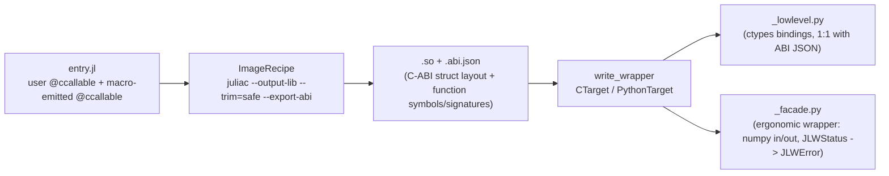

# Spike notes: 1.13 ABI JSON inventory for L1 carriers

Toolchain: Julia 1.13.0-rc3 (juliaup default), `JuliaC.jl` v0.3.8, `--export-abi`. Two spikes,
both green on the local toolchain:

- **Spike A** (Task 2): built `JuliaLibWrapping/examples/ols` unmodified via
  `standard_build` (`CTarget` + `PythonTarget`, `trim = :safe`, bundled), pip-installed the
  resulting wheel into a venv outside the repo tree, and ran `examples/ols/test/smoke.py`
  against it. Result: **build + smoke test both pass**.
- **Spike B** (Task 3, this doc): a throwaway `probe` library (scratchpad only, not
  committed — see `.superpowers/sdd/.../task-3-brief.md` for the verbatim source) built with
  `build_library` directly (`CTarget` + `PythonTarget`, `trim = :safe`, no bundling), to
  inspect `probe.abi.json` for the exact JSON shapes future carrier code depends on.

## Q1 — macro-emitted `@ccallable`s: compiled and exported?

`probe.jl` defines a module-level macro `@emit_free` that expands to two
`Base.@ccallable` functions (`jlw_free`, `jlw_free_strings`) and invokes it once at file
scope (`@emit_free`). **Both symbols appear in `probe.abi.json`'s `"functions"` array**,
with correct signatures:

```
jlw_free(p::Ptr{Nothing})              sym=jlw_free
jlw_free_strings(p::Ptr{Ptr{UInt8}}, n::Int64)   sym=jlw_free_strings
```

**Answer: YES — the macro form works.** `Base.@ccallable` inside a macro expansion is
compiled and exported by `juliac --export-abi` exactly like a directly-written
`Base.@ccallable`. The Task 6 "write ccallables directly in the user file" fallback is
**not needed**; the macro-emission path (`@emit_free`-style) is safe to use for
`jlw_free`/`jlw_free_strings` in JLWInterop's user-facing macro surface.

(The dependency-package variant — moving the `@ccallable`s into a *separate* package that
the user's library merely depends on, rather than emitting them via macro into the user's
own module — was flagged optional in the brief and was **not** probed here. Per the brief,
only the user-file/macro result gates Task 6, so this is not a blocker.)

## Q2 — verbatim renderings, offsets, and what the JSON can't express

### Parametric struct names (verbatim, exact string from JSON)

| Julia type | `"name"` in `"types"` (unqualified) | `"name"` inside a function signature (qualified) |
|---|---|---|
| `CDict{Float64}` | `"CDict{Float64}"` | `Main.probe.CDict{Float64}` (in a function's fully-qualified sig string) |
| `COpt{Float64}` | `"COpt{Float64}"` | `Main.probe.COpt{Float64}` |
| `CStrArray` | `"CStrArray"` | `Main.probe.CStrArray` |

No spaces around `{`/`}`/`,` — standard Julia `Base.show` rendering of a parametric type
with one type argument. **Important asymmetry**: the top-level `types[].name` field is the
**short/unqualified** type name (`"CDict{Float64}"`), but a function's own `"name"` field
(a full call-signature string, distinct from its terse `"symbol"`) embeds the
**fully-qualified** module path for the *same* type (`Main.probe.CDict{Float64}`,
`JLWInterop.CVector{Float64}` in the ols probe — see below). Recognizers built in Task
7–9 that match on type names must account for both spellings depending on which JSON field
they read.

Cross-check from the real `ols.abi.json` (Task 2), same asymmetry, confirming this isn't a
probe-only artifact:

```
types[]:    "name" => "CVector{Float64}"       (unqualified)
functions[]: "name" => "predict(coeffs::JLWInterop.CVector{Float64}, ...)"   (qualified)
```

### `Ptr{Ptr{UInt8}}` chain

Not flattened — expressed as a **linked chain of pointer-type nodes**, each one level of
indirection, resolved via `pointee_type_id`:

```
id=3  kind=pointer  name="Ptr{Ptr{UInt8}}"  pointee_type_id=4
id=4  kind=pointer  name="Ptr{UInt8}"       pointee_type_id=5
id=5  kind=primitive name="UInt8"           bits=8 size=1 alignment=1
```

So `CStrArray.data :: Ptr{Ptr{UInt8}}` resolves via two pointer hops to the `UInt8` leaf.
A consumer must walk `pointee_type_id` recursively rather than pattern-matching the `name`
string alone (though the `name` string is also fully rendered and verbatim-matchable, e.g.
for a quick recognizer regex).

### `COpt{Float64}` field offsets

```json
{"id": 7, "kind": "struct", "name": "COpt{Float64}", "size": 16, "alignment": 8,
 "fields": [
   {"name": "has_value", "type_id": 9 (Int32), "offset": 0},
   {"name": "value",     "type_id": 8 (Float64), "offset": 8}
 ]}
```

`has_value` is `Int32` (4 bytes, ends at offset 4) but `value` starts at offset **8**, not
4 — there are **4 bytes of trailing padding** after `has_value` to satisfy `Float64`'s
8-byte alignment. Total struct size is 16 (not 12), alignment 8. This matches standard C
struct layout rules and is exactly what the brief's `struct COpt{T}; has_value::Int32;
value::T; end` produces for `T = Float64`; **any carrier code that assumes offset 4 for
`value` is wrong** — always read `fields[].offset` from the JSON (or replicate the padding
rule) rather than hand-computing it from field order and sizes.

### `CDict{Float64}` (for comparison — no padding needed here)

```json
{"id": 11, "kind": "struct", "name": "CDict{Float64}", "size": 24, "alignment": 8,
 "fields": [
   {"name": "length", "type_id": 2 (Int64),          "offset": 0},
   {"name": "keys",   "type_id": 3 (Ptr{Ptr{UInt8}}), "offset": 8},
   {"name": "values", "type_id": 12 (Ptr{Float64}),   "offset": 16}
 ]}
```

All three fields are already 8-byte-aligned in declaration order, so no padding — offsets
are simply cumulative (`0, 8, 16`), size `24`.

### Other observations

- **Function ordering in `"functions"` is not declaration order.** The probe file declares
  `probe_strs, probe_dict, probe_opt, jlw_free, jlw_free_strings` (source order), but the
  emitted JSON order was `probe_strs, jlw_free_strings, probe_opt, jlw_free, probe_dict` —
  apparently unordered / hash-bucket order. Don't rely on JSON array order matching source
  order; match on `"symbol"` instead.
- **`Ptr{Cvoid}` renders as `Ptr{Nothing}`** in the JSON (`jlw_free(p::Ptr{Nothing})`), and
  a synthetic zero-size `Nothing` struct type (`size=0, alignment=1, fields=[]`) is emitted
  as its pointee. `Cvoid` is a type alias for `Nothing` in Base, so this is just Julia's
  canonical printing, not a JuliaC quirk — but recognizers must expect `Ptr{Nothing}`, not
  `Ptr{Cvoid}`, in both `"types"` and function signatures.
- Both spikes used `trim = :safe`; neither hit a `TrimFailure` or a Verifier error. The
  rc3 + `--export-abi` toolchain handled the ols example, plain structs, parametric
  structs, and macro-emitted `@ccallable`s without incident.

### What the ABI JSON cannot express (sidecar-metadata gap)

The JSON is a pure **C-ABI layout description** — struct field offsets/sizes/alignment,
pointer indirection chains, and function symbol/signature strings. It carries **zero**
semantic/ownership metadata. Concretely, nothing in the JSON distinguishes:

- **Ownership/lifetime** — whether a `Ptr{T}` field is *borrowed* (caller retains
  ownership, callee must not free) or *owned* (callee mallocs it, caller must free via a
  specific release entrypoint). `CDict.keys`, `CDict.values`, `CStrArray.data`, and
  `jlw_free`'s `Ptr{Nothing}` argument are all just `"kind": "pointer"` — the "borrow-in
  copy / own-out malloc" convention this project is built around is entirely
  out-of-band knowledge that must live in a hand-maintained sidecar (recognizer + doc
  comments), not derivable from `probe.abi.json` alone.
- **String-ness** — `Ptr{UInt8}` is indistinguishable in the JSON from "pointer to a
  single raw byte" vs "pointer to a null-terminated C string" vs (via one more hop)
  "pointer to an array of C-string pointers" (`CStrArray.data :: Ptr{Ptr{UInt8}}`). The
  JSON has no string/array/null-termination tag at all — this must come from the
  recognizer matching the carrier struct *shape* (a `{length, data}` or `{length, keys,
  values}` layout) by convention, not from any JSON field.
- **Boolean-like semantics** — `COpt.has_value` is plain `Int32` in the JSON; nothing
  marks it as a 0/1 boolean discriminant vs an arbitrary integer.
- **Which functions are release/free entrypoints** vs normal user functions — `jlw_free`
  and `jlw_free_strings` appear in `"functions"` with no special flag; a consumer must
  recognize them by name convention (`jlw_free*`) or an out-of-band allowlist, exactly as
  Task 6/7 already plan.
- **Docstrings / provenance** — no comments, no source location, nothing tying a type or
  function back to the Julia source that produced it.

None of this is a defect in `--export-abi` — it's a plain C-ABI dump, as designed. It does
confirm that JLWInterop's carriers need a **hand-authored sidecar** (recognizer + allowlist,
per the existing plan) rather than anything derivable purely from the ABI JSON.

## Observed pipeline



This matches what both spikes exercised directly: Spike A ran the full pipeline end-to-end
(`ols.jl` → `ols.so` + `ols.abi.json` → `ols_py/{_lowlevel.py,_facade.py,__init__.py}` →
pip install → `smoke.py` passing against the real wheel); Spike B ran only the left half
(`probe.jl` → `probe.so` + `probe.abi.json`) since the goal was JSON inspection, not a
Python round-trip.
